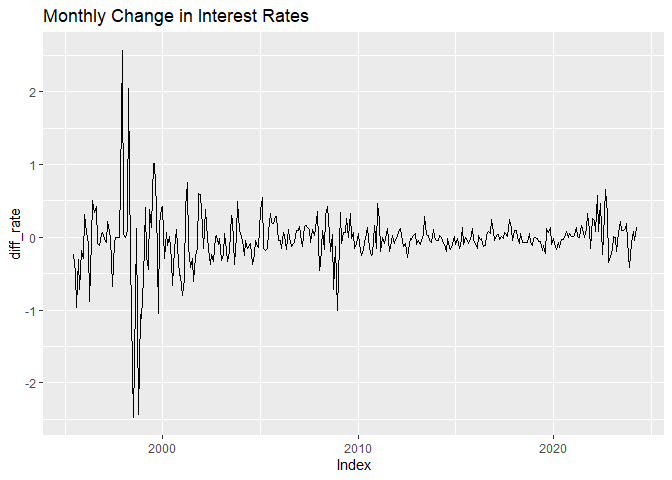
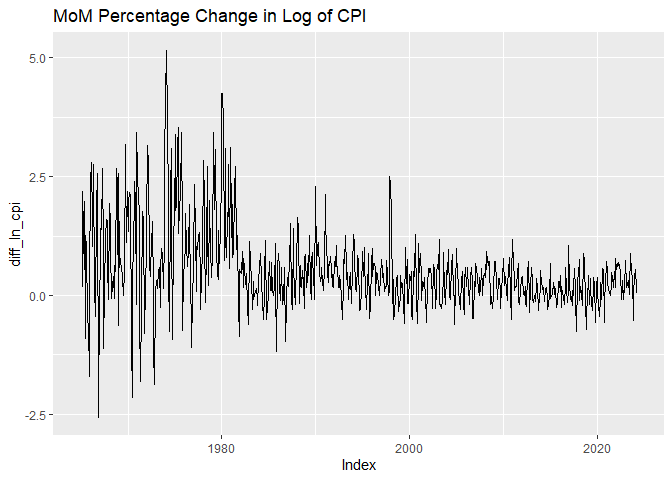
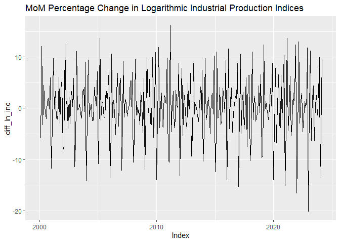
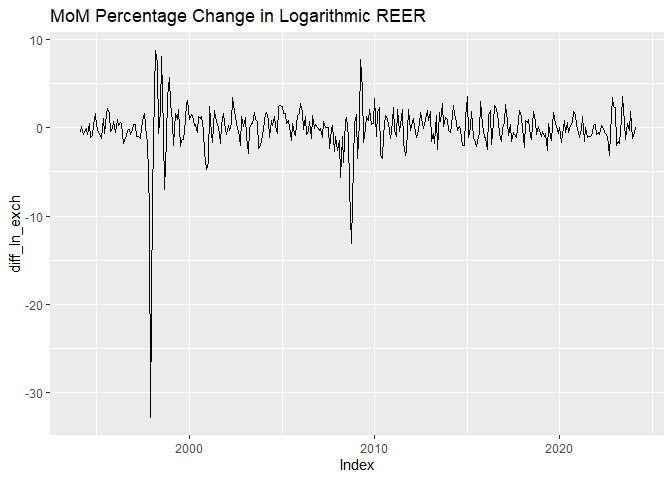
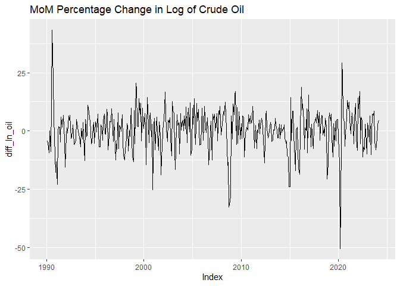
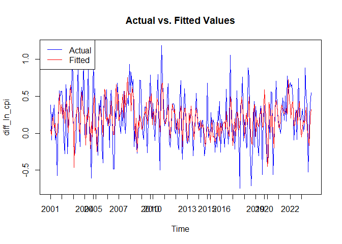

2024-04-19 Korean CPI Analysis VECM Approach
================

### Introduction

Inflation is a critical economic indicator that influences both
macroeconomic policy and individual financial decisions. This analysis
explores several potential determinants of Korean inflation, utilizing
the R software for statistical computing. Our study focuses on four
critical economic indicators: interest rates, growth rates, exchange
rates, and oil prices. These factors are significant for understanding
the intricacies of Korea’s economic landscape.

Our challenge lies in the non-stationary nature of our data, which
becomes stationary after differencing. This condition makes the Vector
Error Correction Model(VECM) the preferred method for our analysis. This
approach helps us uncover the intricate relationships between these
economic indicators and their combined impact on inflation.

### Methodology

The data were sourced from reputable database, ensuring reliability and
relevance. We used ECOS, the economic statistical portal of the Bank of
Korea, and FRED, maintained by the Federal Reserve Bank of St. Louis. We
chose the industrial production index due to its monthly frequency,
providing a consistent data set for analysis.

All data used are non-seasonally adjusted, primarily because it is
readily available and officially published by the government. Since
seasonally adjusted CPI data for Korea is not publicly available, we
opted to standardized all data to non-seasonally adjusted for
uniformity.

We employed R packages such as `dplyr`, `xts`, `ggplot2`, and
`lubridate` for data manipulation and visualization. Data Retrieval was
streamlined using API keys from ECOS and FRED, focusing on extracting
critical indicators like Treasury Bonds yields and the Consumer Price
Index.

``` r
library(dplyr)
library(xts)
library(ggplot2)
library(lubridate);
library(ecos)

# ecos.setKey('your key')

library(fredr)

# fredr_set_key("your key")

# 1. Yields of Treasury Bonds(3yr)

# Data Retrieval and Initial Processing
rate <- statSearch(stat_code = "721Y001",
                   item_code1 = "5020000", cycle="M")
#  extracting only the time and data_value columns from the rate dataset
rate <- dplyr::select(rate, time, data_value) %>% mutate(time=ym(time))

names(rate) <- c("date","rate")
rate$date <- as.Date(rate$date)

# Convert the dataframe to a time series object for easier time series manipulation
rate <-xts(rate$rate, order.by=rate$date)
colnames(rate) <- "rate"

# Calculate the 1-month difference of the rate rates to analyze MoM changes
diff_rate <- diff(rate, differences = 1)
names(diff_rate) <- c("diff_rate")

autoplot(diff_rate)+ 
  ggtitle("Monthly Change in Interest Rates")
```

    ## Warning: Removed 1 row containing missing values (`geom_line()`).

<!-- -->

``` r
# 2. CPI, 2020=100

cpi <- statSearch(stat_code = "901Y009",
                  item_code1="0", cycle = "M")
cpi <- dplyr::select(cpi, time, data_value) %>% mutate(time=ym(time))

names(cpi) <- c("date", "cpi")
cpi <- xts(cpi$cpi, order.by=cpi$date)

ln_cpi <- log(cpi)
names(ln_cpi) <- c("ln_cpi")
diff_ln_cpi <- diff(ln_cpi, differences = 1) * 100
names(diff_ln_cpi) <- c("diff_ln_cpi")
autoplot(diff_ln_cpi) + 
  ggtitle("MoM Percentage Change in Log of CPI")
```

    ## Warning: Removed 1 row containing missing values (`geom_line()`).

<!-- -->

``` r
# 3. Industrial Production Indices (nsa)

ind <- statSearch(stat_code = "901Y033",
                  item_code1 ="A00", item_code2="1", cycle="M")

ind <- dplyr::select(ind, time, data_value) %>% mutate(time=ym(time))
names(ind) <- c("date", "ind")
ind <- xts(ind$ind, order.by=ind$date)
names(ind) <- c("ind")

ln_ind <- log(ind)
names(ln_ind) <- c("ln_ind")
diff_ln_ind <- diff(ln_ind, differences = 1) * 100
names(diff_ln_ind) <- c("diff_ln_ind")
autoplot(diff_ln_ind) + 
  ggtitle("MoM Percentage Change in Logarithmic Industrial Production Indices")
```

    ## Warning: Removed 1 row containing missing values (`geom_line()`).

<!-- -->

``` r
# 4. Real Broad Effective Exchange Rate for Korea (nsa)

exch <- fredr(
  series_id = "RBKRBIS",
  frequency = "m" # m: monthly, q: quarterly
)

exch <- dplyr::select(exch, date, value) 

names(exch) <- c("date", "exch")

exch <- xts(exch$exch, order.by=exch$date)
names(exch) <- c("exch")
exch <- na.omit(exch)

ln_exch <- log(exch)
names(ln_exch) <- c("ln_exch")
diff_ln_exch <- diff(ln_exch, differences = 1) * 100
names(diff_ln_exch) <- c("diff_ln_exch")
autoplot(diff_ln_exch) + 
  ggtitle("MoM Percentage Change in Logarithmic REER")
```

    ## Warning: Removed 1 row containing missing values (`geom_line()`).

<!-- -->

``` r
# 5.crude oil (nsa)
oil <- fredr(
  series_id = "POILAPSPUSDM",
  frequency = "m" # m: monthly, q: quarterly
)

oil <- dplyr::select(oil, date, value) 

names(oil) <- c("date", "oil")

oil <- xts(oil$oil, order.by=oil$date)
names(oil) <- c("oil")
oil <- na.omit(oil)

ln_oil <- log(oil)
names(ln_oil) <- c("ln_oil")
diff_ln_oil <- diff(ln_oil, differences = 1) * 100
names(diff_ln_oil) <- c("diff_ln_oil")
autoplot(diff_ln_oil) + 
  ggtitle("MoM Percentage Change in Log of Crude Oil")
```

    ## Warning: Removed 1 row containing missing values (`geom_line()`).

<!-- -->

### Data Merge

The next step involves consolidating the five chosen variables into a
single data set. The analysis will span from January 2001 to February
2024, offering a comprehensive overview of the period in question.

``` r
# Subset the series to include data from 2001 onwards
ln_cpi <- window(ln_cpi, start=as.Date("2001-01-01"), end=as.Date("2024-02-01"))
ln_ind <- window(ln_ind, start=as.Date("2001-01-01"), end=as.Date("2024-02-01"))
rate <- window(rate, start=as.Date("2001-01-01"), end=as.Date("2024-02-01"))
ln_oil <- window(ln_oil, start=as.Date("2001-01-01"), end=as.Date("2024-02-01"))
ln_exch <- window(ln_exch, start=as.Date("2001-01-01"), end=as.Date("2024-02-01"))

data_lv <- merge(ln_cpi, ln_ind, ln_exch, ln_oil, rate)
data_lv <- as.data.frame(data_lv)


diff_ln_cpi <- window(diff_ln_cpi, start=as.Date("2001-01-01"), end=as.Date("2024-02-01"))
diff_ln_ind <- window(diff_ln_ind, start=as.Date("2001-01-01"), end=as.Date("2024-02-01"))
diff_rate <- window(diff_rate, start=as.Date("2001-01-01"), end=as.Date("2024-02-01"))
diff_ln_oil <- window(diff_ln_oil, start=as.Date("2001-01-01"), end=as.Date("2024-02-01"))
diff_ln_exch <- window(diff_ln_exch, start=as.Date("2001-01-01"), end=as.Date("2024-02-01"))


data_diff_ln <- merge(diff_ln_cpi, diff_ln_ind, diff_ln_exch, diff_ln_oil, diff_rate)
data_diff_ln <- as.data.frame(data_diff_ln)
```

To apply a Vector Error Correction Model(VECM), certain prerequisites
must be met, including the stationarity of differenced series and the
presence of long-term cointegration among variables.

## The Augmented Dickey-Fuller test to check for stationarity

Our initial data exhibits non-stationarity, a common characteristic in
economics time series. To preprare for VECM analysis, it’s crucial to
establish that the differened data no longer follow a unit root process.
We employ the Augmented Dickey-Fuller (ADF) test to confirm
stationarity. This test helps determine whether each differenced series
is stationary, a prerequisite for the subsequent VECM.

The p-values obtained were below the 0.01 threshold, confirming that all
differenced series are indeed stationary.

    ## Warning in adf.test(diff_ln_cpi, alternative = "stationary"): p-value smaller
    ## than printed p-value

    ## 
    ##  Augmented Dickey-Fuller Test
    ## 
    ## data:  diff_ln_cpi
    ## Dickey-Fuller = -5.0404, Lag order = 6, p-value = 0.01
    ## alternative hypothesis: stationary

    ## Warning in adf.test(diff_ln_ind, alternative = "stationary"): p-value smaller
    ## than printed p-value

    ## 
    ##  Augmented Dickey-Fuller Test
    ## 
    ## data:  diff_ln_ind
    ## Dickey-Fuller = -10.539, Lag order = 6, p-value = 0.01
    ## alternative hypothesis: stationary

    ## Warning in adf.test(diff_ln_exch, alternative = "stationary"): p-value smaller
    ## than printed p-value

    ## 
    ##  Augmented Dickey-Fuller Test
    ## 
    ## data:  diff_ln_exch
    ## Dickey-Fuller = -5.6494, Lag order = 6, p-value = 0.01
    ## alternative hypothesis: stationary

    ## Warning in adf.test(diff_ln_oil, alternative = "stationary"): p-value smaller
    ## than printed p-value

    ## 
    ##  Augmented Dickey-Fuller Test
    ## 
    ## data:  diff_ln_oil
    ## Dickey-Fuller = -6.4893, Lag order = 6, p-value = 0.01
    ## alternative hypothesis: stationary

    ## Warning in adf.test(diff_rate, alternative = "stationary"): p-value smaller
    ## than printed p-value

    ## 
    ##  Augmented Dickey-Fuller Test
    ## 
    ## data:  diff_rate
    ## Dickey-Fuller = -6.9702, Lag order = 6, p-value = 0.01
    ## alternative hypothesis: stationary

### Johansen Cointegration Test

To explore potential long-run relationships between out variables, we
conducted the Johansen cointegration test using the `urca` package. This
test identifies the number of cointegrating vectors that exist among the
series. Our results indicate up to two cointegrating relationships; the
test statistic for ‘r\<=1’ exceeds the 1% critical value, suggesting at
least one cointegrating equation, but not for ‘r\<=2’. Therefore, we
select r=2 for our model to capture the primary long-term relationship
among the variables.

``` r
library(urca)

coint_lv <- ca.jo(data_lv, spec = 'longrun', type = 'eigen', ecdet = "const", K = 2)
summary(coint_lv)
```

    ## 
    ## ###################### 
    ## # Johansen-Procedure # 
    ## ###################### 
    ## 
    ## Test type: maximal eigenvalue statistic (lambda max) , without linear trend and constant in cointegration 
    ## 
    ## Eigenvalues (lambda):
    ## [1]  5.010489e-01  2.198447e-01  5.191758e-02  2.125407e-02  1.671013e-02
    ## [6] -3.668832e-16
    ## 
    ## Values of teststatistic and critical values of test:
    ## 
    ##            test 10pct  5pct  1pct
    ## r <= 4 |   4.65  7.52  9.24 12.97
    ## r <= 3 |   5.93 13.75 15.67 20.20
    ## r <= 2 |  14.71 19.77 22.00 26.81
    ## r <= 1 |  68.52 25.56 28.14 33.24
    ## r = 0  | 191.89 31.66 34.40 39.79
    ## 
    ## Eigenvectors, normalised to first column:
    ## (These are the cointegration relations)
    ## 
    ##                ln_cpi.l2   ln_ind.l2   ln_exch.l2   ln_oil.l2     rate.l2
    ## ln_cpi.l2   1.0000000000  1.00000000   1.00000000  1.00000000  1.00000000
    ## ln_ind.l2  -0.7963515858 -1.23131675  -0.26559540 -0.07796253 -0.11079664
    ## ln_exch.l2  0.0846059822  0.86451194   1.81794863  0.54435319 -1.42851368
    ## ln_oil.l2   0.0087978906  0.06853869   0.27744497 -0.23228438  0.01377574
    ## rate.l2    -0.0004024199 -0.14255830   0.09276244  0.07201617  0.16207136
    ## constant   -1.3584356170 -3.24689395 -13.13563972 -5.94027337  1.94709543
    ##               constant
    ## ln_cpi.l2   1.00000000
    ## ln_ind.l2  -0.11532203
    ## ln_exch.l2 -0.04694841
    ## ln_oil.l2  -0.07163093
    ## rate.l2     0.02560518
    ## constant   -3.52698321
    ## 
    ## Weights W:
    ## (This is the loading matrix)
    ## 
    ##             ln_cpi.l2    ln_ind.l2    ln_exch.l2     ln_oil.l2       rate.l2
    ## ln_cpi.d  -0.02844786 -0.003837892 -0.0002693541 -9.826087e-05 -0.0005038634
    ## ln_ind.d   1.44278136 -0.009914235  0.0003286799  5.428193e-03 -0.0022123464
    ## ln_exch.d  0.01187536  0.000196306 -0.0162322657 -6.276331e-03  0.0024276935
    ## ln_oil.d  -0.24841666 -0.001579569 -0.0374910685  1.130967e-01 -0.0221338929
    ## rate.d    -0.12835210  0.053426370 -0.0209179291 -1.200230e-01 -0.1049079918
    ##                constant
    ## ln_cpi.d   5.371687e-15
    ## ln_ind.d  -2.700430e-13
    ## ln_exch.d -4.026128e-14
    ## ln_oil.d  -4.618860e-14
    ## rate.d    -8.968630e-15

### Optimal Lag Selection

Choosing the optimal lag length for the VECM is critical to balance
model complexity and explanatory power. Criteria such as the
Hannan-Quinn (HQ) and Schwarz Criterion (SC) suggested a lag length of
2, which we adopted for its simplicity and effectiveness in capturing
the dynamics among the variables.

``` r
library(vars)
# Determining optimal lag length
lag_lv <- VARselect(data_lv, type = "const")
print(lag_lv)
```

    ## $selection
    ## AIC(n)  HQ(n)  SC(n) FPE(n) 
    ##     10      3      2     10 
    ## 
    ## $criteria
    ##                    1             2             3             4             5
    ## AIC(n) -3.355413e+01 -3.417984e+01 -3.441790e+01 -3.452835e+01 -3.457763e+01
    ## HQ(n)  -3.339267e+01 -3.388384e+01 -3.398736e+01 -3.396326e+01 -3.387800e+01
    ## SC(n)  -3.315215e+01 -3.344288e+01 -3.334597e+01 -3.312143e+01 -3.283573e+01
    ## FPE(n)  2.676972e-15  1.432140e-15  1.129283e-15  1.012113e-15  9.648406e-16
    ##                    6             7             8             9            10
    ## AIC(n) -3.466934e+01 -3.465316e+01 -3.462581e+01 -3.471080e+01 -3.484765e+01
    ## HQ(n)  -3.383517e+01 -3.368444e+01 -3.352254e+01 -3.347299e+01 -3.347530e+01
    ## SC(n)  -3.259246e+01 -3.224130e+01 -3.187897e+01 -3.162898e+01 -3.143085e+01
    ## FPE(n)  8.821781e-16  8.992311e-16  9.278145e-16  8.565328e-16  7.517199e-16

### VECM

With the prerequisites confirmed and parameters set, we proceed to fit
the VECM. This model helps us understand how each variable responds to
adjustments towards long-term equilibrium after experiencing shocsk. An
examination of the fitted values against actual data will illustrate the
model’s accuracy and predictive power.

``` r
library(tsDyn)
vecm_lv <- VECM(data_lv, lag = 2, estim = "ML", r = 2, include = "both") 

summary(vecm_lv)
```

    ## #############
    ## ###Model VECM 
    ## #############
    ## Full sample size: 278    End sample size: 275
    ## Number of variables: 5   Number of estimated slope parameters 70
    ## AIC -9458.853    BIC -9183.979   SSR 12.29852
    ## Cointegrating vector (estimated by ML):
    ##    ln_cpi       ln_ind    ln_exch      ln_oil        rate
    ## r1      1 5.551115e-17 0.08762648 -0.07535542 -0.01202746
    ## r2      0 1.000000e+00 0.02081896 -0.09993089 -0.01203788
    ## 
    ## 
    ##                  ECT1                ECT2                Intercept          
    ## Equation ln_cpi  -0.0668(0.0104)***  0.0358(0.0073)***   0.1536(0.0322)***  
    ## Equation ln_ind  0.8558(0.1381)***   -0.8301(0.0963)***  -0.5110(0.4269)    
    ## Equation ln_exch 0.1684(0.0571)**    -0.0494(0.0398)     -0.5324(0.1764)**  
    ## Equation ln_oil  0.0197(0.2977)      0.3567(0.2075).     -1.4273(0.9202)    
    ## Equation rate    -0.2344(0.6864)     0.2855(0.4784)      -0.1259(2.1216)    
    ##                  Trend               ln_cpi -1          ln_ind -1          
    ## Equation ln_cpi  3.6e-05(1.4e-05)*   0.2500(0.0568)***  -0.0263(0.0053)*** 
    ## Equation ln_ind  0.0003(0.0002)      -5.8472(0.7540)*** -0.0786(0.0709)    
    ## Equation ln_exch -0.0002(7.7e-05)**  0.1047(0.3117)     0.0818(0.0293)**   
    ## Equation ln_oil  -0.0009(0.0004)*    2.2138(1.6256)     -0.2064(0.1529)    
    ## Equation rate    1.5e-06(0.0009)     3.6571(3.7478)     0.1403(0.3525)     
    ##                  ln_exch -1          ln_oil -1          rate -1           
    ## Equation ln_cpi  0.0195(0.0112).     0.0083(0.0022)***  0.0011(0.0009)    
    ## Equation ln_ind  0.0277(0.1480)      0.0325(0.0291)     0.0320(0.0123)**  
    ## Equation ln_exch 0.3715(0.0612)***   0.0077(0.0120)     0.0073(0.0051)    
    ## Equation ln_oil  0.9377(0.3191)**    0.3166(0.0627)***  0.0251(0.0265)    
    ## Equation rate    -0.0448(0.7357)     0.2496(0.1446).    0.3024(0.0610)*** 
    ##                  ln_cpi -2           ln_ind -2           ln_exch -2         
    ## Equation ln_cpi  -0.2342(0.0597)***  -0.0175(0.0041)***  -0.0106(0.0111)    
    ## Equation ln_ind  0.6847(0.7928)      -0.3114(0.0545)***  -0.3154(0.1470)*   
    ## Equation ln_exch -0.3686(0.3277)     0.0108(0.0225)      -0.2061(0.0607)*** 
    ## Equation ln_oil  0.7770(1.7091)      -0.1140(0.1175)     0.2811(0.3168)     
    ## Equation rate    1.5014(3.9403)      0.1227(0.2709)      1.1379(0.7304)     
    ##                  ln_oil -2           rate -2            
    ## Equation ln_cpi  -0.0012(0.0022)     -0.0006(0.0009)    
    ## Equation ln_ind  0.0888(0.0297)**    0.0110(0.0124)     
    ## Equation ln_exch 0.0099(0.0123)      0.0094(0.0051).    
    ## Equation ln_oil  -0.1349(0.0639)*    0.0194(0.0266)     
    ## Equation rate    0.0260(0.1474)      -0.1516(0.0614)*

### Performance Analysis of the VECM

``` r
actual_values <- data_diff_ln$diff_ln_cpi[4:length(data_diff_ln$diff_ln_cpi)]
fitted_values <- fitted(vecm_lv)[, "ln_cpi"]*100
# Plot actual vs. fitted values
dates <- as.Date(attr(fitted_values, "names"))

plot(dates, actual_values, type = 'l', col = 'blue', ylim = range(c(fitted_values, actual_values)), ylab = 'diff_ln_cpi', xlab = 'Time', main = 'Actual vs. Fitted Values')
lines(dates, fitted_values, col = 'red')
legend("topleft", legend = c("Actual", "Fitted"), col = c("blue", "red"), lty = 1)

axis.Date(1, at = seq(min(dates), max(dates), by = "years"), format = "%Y")  # Modify 'by' as needed
```

<!-- -->

From the plot, it appears that the fitted values from the VECM do not
capture the full amplitude of fluctuations shown by the actual values.
The fitted line tends to have a narrower range, which indicates that the
model may be soothing out some of the more extreme changes observed in
the actual data.

``` r
# Calculate RMSE
rmse <- sqrt(mean((actual_values - fitted_values)^2))
print(paste("RMSE:", rmse))
```

    ## [1] "RMSE: 0.288388325020791"

``` r
# Calculate MAE
mae <- mean(abs(actual_values - fitted_values))
print(paste("MAE:", mae))
```

    ## [1] "MAE: 0.227310408168628"

``` r
# Calculate MAPE
mape <- mean(abs((actual_values - fitted_values) / actual_values)) * 100
print(paste("MAPE:", mape, "%"))
```

    ## [1] "MAPE: Inf %"

``` r
# Calculate Adjusted R-squared
# R-squared can be extracted from the model summary if provided, or calculated as follows:
rss <- sum((actual_values - fitted_values)^2)
tss <- sum((actual_values - mean(actual_values))^2)
r_squared <- 1 - rss/tss

n <- length(actual_values)  # Number of observations
k <- 4 + 10 * 5 + 1  # Number of parameters in the model: cointegrating relations (r) + lagged differences (lag * number of variables) + intercept

adjusted_r_squared <- 1 - (1 - r_squared) * ((n - 1) / (n - k - 1))
print(paste("Adjusted R-squared:", adjusted_r_squared))
```

    ## [1] "Adjusted R-squared: 0.164879206708203"

``` r
# AIC and BIC (if not already provided in the summary)
# AIC = 2k - 2ln(L) where L is the likelihood of the model, k is the number of parameters
# BIC = ln(n)k - 2ln(L)
# For VECM models in 'tsDyn', log-likelihood can be extracted from the model object

log_likelihood <- logLik(vecm_lv)
aic <- AIC(vecm_lv)
bic <- BIC(vecm_lv)

print(paste("AIC:", aic))
```

    ## [1] "AIC: -9458.85348738583"

``` r
print(paste("BIC:", bic))
```

    ## [1] "BIC: -9183.97888396317"

``` r
# Check for stability
# Extract eigenvalues
eigenvalues <- vecm_lv$model.specific$lambda

# Check the modulus of each eigenvalue
modulus <- Mod(eigenvalues)

# Print the eigenvalues and their modulus
print(eigenvalues)
```

    ## [1] 0.27331273 0.09306013 0.05994747 0.02546531 0.01138339

``` r
print(modulus)
```

    ## [1] 0.27331273 0.09306013 0.05994747 0.02546531 0.01138339

``` r
# Stability condition: All eigenvalues should have modulus less than 1
is.stable <- all(modulus < 1)

# Print the stability status
print(is.stable)
```

    ## [1] TRUE

Generally lower RAMSE and MAE values are considered better. Without
context or a benchmark model for comparison, it’s hard to definitely
assess these values as good or bad.

The MAPE shwoing infinite values further complicates the effectiveness
of the model in practical dynamics.

The low value of approximately 16% for the adjusted R-squared suggests
limited explanatory power of the model. This results points to the
model’s inadequate representation of the underlying economic dynamics.

### Conclusion

The VECM applied in this study reveals significant limitations in
capturing the full amplitude of inflation fluctuations observed in the
actual data. Notably, the fitted values from the VECM exhibit a
constrained range compared to the actual data, suggesting that the model
may be smoothing out some of the more pronounced changes.

One of the inherent challenges with the VECM used in this analysis is
its assumption that all included variables adjust to restore equilibrium
when disturbances occur. This assumption may not hold if some of the
variables, such as the interest rates, function as exogenous within the
system. Consequently, their dynamic impacts on inflation might not be
captured accurately, highlighting a potential mis-specification in the
model structure.
