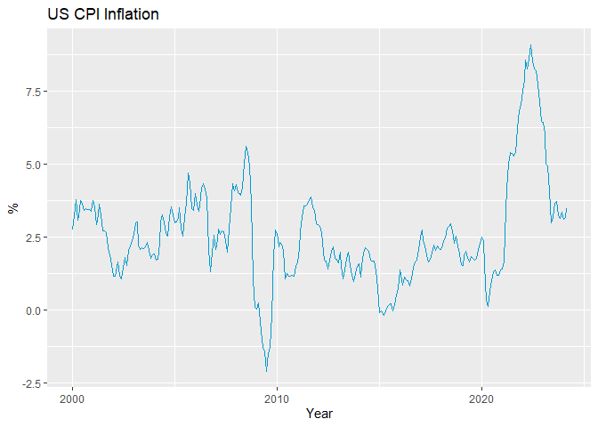
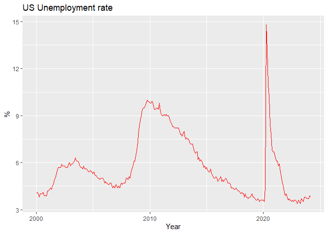

2024-04-30-Considering the Prospect of Rising Interest Rates
================
Edith
2024-04-30

#### Will the Federal Reserve raise interest rates?

My view leans towards rates either holding steady or increasing. The
primary rationale for this expectation is that there are no immediate
signs suggesting the economy is on the verge of a recession. The labor
market remains robust, the Conference Board’s Consumer Confidence Index
continues to show strength, and inflation has stabilized around 3%.
These indicators suggest that the U.S. economy is not currently in a
downturn, nor does it appear to be heading towards one.

However, the risks associated with maintaining high interest rates
cannot be overlooked, as they might lead to an economic slowdown over
time. Despite these concerns, if this were the sole reason for the Fed
to consider lowering rates, it is unlikely they would act on that basis
alone. It is more probable that they will adopt a ‘wait and see’
approach, evaluating whether the economy can sustain its growth under
the current interest rate regime.

<!-- --><!-- -->
